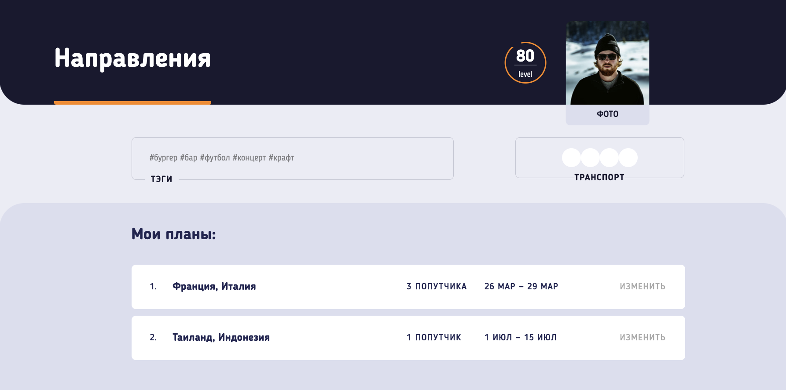

# Web service (study project)

On this project, I got acquainted with the world of
the Web and learned basic skills in site building
The project is made with adaptive, fluid layout

## Technologies

1. HTML
2. CSS/SASS (Grid, Flex, Bam)
3. Js
4. Gulp

## Screenshots

  
  
  
  
  
  
